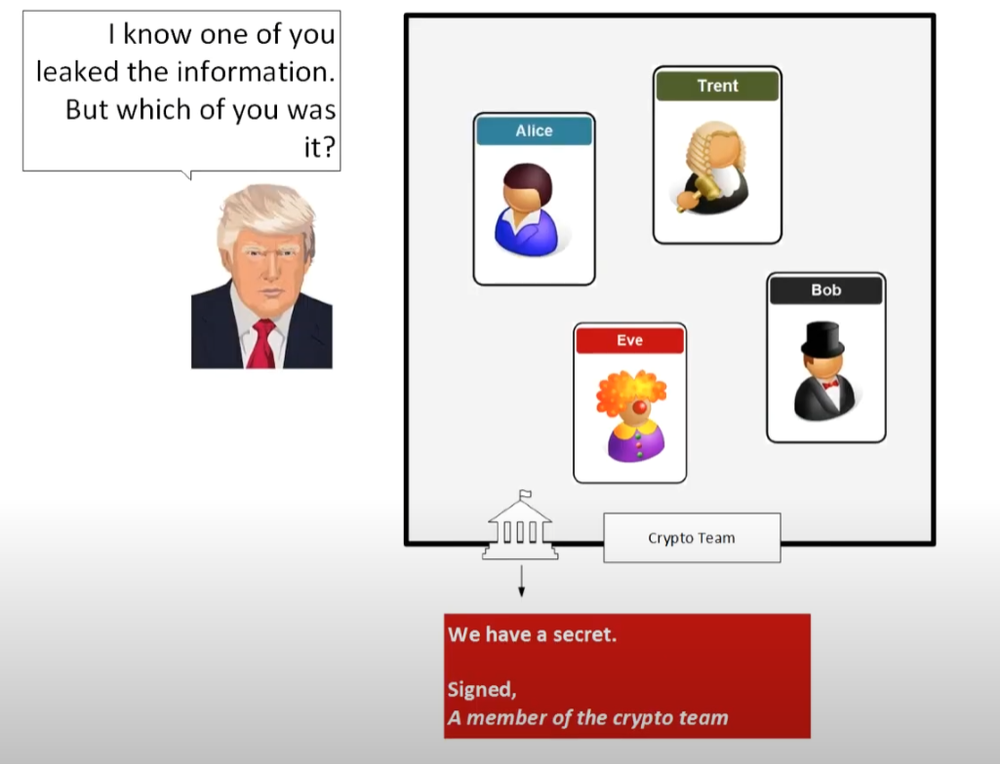
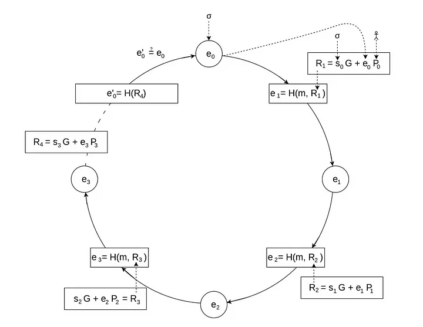
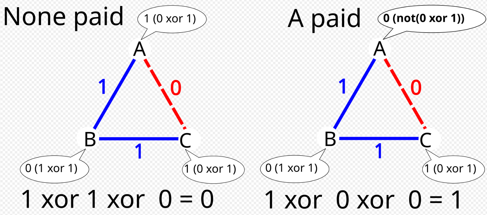

# WARNING
This is probably hazards because I don't know best practices.
I write this only for fun and learning.
Do not use it on real things.
Checkout Pycryptodome [here](https://github.com/Legrandin/pycryptodome) and [here](https://pycryptodome.readthedocs.io/en/latest/)


# Asymmetric-Encryption
Asymmetric encryption uses two keys, one public, one private.
You can encrypt with the public key and only decrypt with the private key.
You can also sign with them.

# Installation
```
pip install asymmetric-encryption
```
[In PyPI](https://pypi.org/project/asymmetric-encryption/)

# Running tests
If cloned run this command to run tests

(Enter the venv first obviously)
```
cd .\test\
python -m unittest discover 
```

# Table of contents

---
If you don't know what you're doing, use [Unhazardous](#unhazardous)

| Algorithm                                        | Code                             | Math behind it                   |
|--------------------------------------------------|----------------------------------|----------------------------------|
| [RSA](#rsa)                                      | [Code](#rsa-code)                | [Math](#rsa-math)                |
| [ElGamal](#elgamal)                              | [Code](#elgamal-code)            | [Math](#elgamal-math)            |
| [DSA](#dsa)                                      | [Code](#dsa-code)                | [Math](#dsa-math)                |
| [ECC](#ecc)                                      | [Code](#ecc-code)                | [Math](#ecc-math)                |
| [DLIES](#dlies)                                  | [Code](#dlies-code)              | [Math](#dlies-math)              |
| [LWE](#learning-with-errors)                     | [Code](#lwe-code)                | [Math](#lwe-math)                |
| [PKCS7](#pkcs7)                                  | [Code](#pkcs7-code)              | [Math](#pkcs7-math)              |
| [OAEP](#oaep)                                    | [Code](#oaep-code)               | [Math](#oaep-math)               |
| [DH](#diffie-hellman)                            | [Code](#dh-code)                 | [Math](#dh-math)                 |
| [YAK](#yak)                                      | [Code](#yak-code)                | [Math](#yak-math)                |
| [MQV](#mqv)                                      | [Code](#mqv-code)                | [Math](#mqv-math)                |
| [ECDSA](#ECDSA)                                  | [Code](#ecdsa-code)              | [Math](#ecdsa-math)              |
| [Ring Signatures](#rs)                           | [Code](#rs-code)                 | [Math](#rs-math)                 |
| [AOS Ring Signatures](#aos-rs)                   | [Code](#aos-rs-code)             | [Math](#aos-rs-math)             |
| [SSS](#sss)                                      | [Code](#sss-code)                | [Math](#sss-math)                |
| [Fiat–Shamir](#fiat-shamir-zero-knowledge-proof) | [Code](#fiat-shamir-code)        | [Math](#fiat-shamir-math)        |
| [OT1O2](#oblivious-transfer)                     | [Code](#oblivious-transfer-code) | [Math](#oblivious-transfer-math) |
| [TPP](#three-pass-protocol)                      | [Code](#tpp-code)                | [Math](#tpp-math)                |
| [POK](#proof-of-knowledge)                       | [Code](#pok-code)                | [Math](#pok-math)                |
| [Kerberos](#Kerberos)                            | [Code](#Kerberos-code)           | [Math](#Kerberos-math)           |
| [MPC - Addition](#mpc-add)                       | [Code](#mpc-add-code)            | [Math](#mpc-add-math)            |
---


# Math symbols
- Pow : **
- Modulo / Mod : %
- XOR : ^
- Append : ||
- x**-1 % n : means the [Modular multiplicative inverse](https://en.wikipedia.org/wiki/Modular_multiplicative_inverse),
    means that if d = e**-1 % n -> e*d % n == 1


# Not my code
- [Prime Number Generator](https://www.geeksforgeeks.org/how-to-generate-large-prime-numbers-for-rsa-algorithm/)
- [Repeating key xor \ OTP (one-time-pad)](https://www.geeksforgeeks.org/encrypt-using-xor-cipher-with-repeating-key/)
- [Shamir's Secret Sharing](#https://www.geeksforgeeks.org/implementing-shamirs-secret-sharing-scheme-in-python/)
- [Unedited ECC](https://github.com/cgossi/fundamental_cryptography_with_python/blob/main/implementing_p_256_ecdhe.py)
---

# RSA
RSA stands for Rivest–Shamir–Adleman, the three people who invented it (Ron Rivest, Adi Shamir, and Leonard Adleman).

RSA is considered one of the best asymmetric crypto systems.
Used for authentication and Diffie-Hellman exchanges.

Problems:
If m >= n then the encryption wouldn't work

- [code here](#rsa-code)
- [math here](#rsa-math)
## RSA Math
```
==============================================
                   Generate
----------------------------------------------
let p and q be prime numbers
let n = p * q
let tot(n) = (p - 1) * (q - 1)
let e be prime number such that 2 < e < tot_n -1 and gcd(e, tot_n) == 1
let d = e**-1 % tot_n
        |
        ⌄
It took me ages to figure out what that means.
Basically if you do e * d and then mod it by tot_n you get 1.
e and d must be inteager primes.
For example:
p = 5 // Prime should be a lot larger this is for example. 
q = 7 // ^^^^^^^^^^^^^^^^^^^^^^^^^^^^^^^^^^^^^^^^^^^^^^^^^
n = 35 // p * q, 5 * 7 = 35
tot_n = 24 // (p - 1) * (q - 1), (5 - 1) * (7 - 1) = 4 * 6 = 24
e = 5 // greatest common denemenator between tot_n and e is 1
(e * d) % tot_n = 1
d = 5 // 5 * 5 = 25, 25 % 24 is 1


Public: e, n
Private: p, q, tot_n, d
==============================================
                   Encryption
----------------------------------------------
c = m**e % n
==============================================
                   Decryption
----------------------------------------------
m = c**d % n
==============================================
                   Signature
----------------------------------------------
s = m**d % n
==============================================
                    Verify 
----------------------------------------------
v = s**e % n
m == v
==============================================
```
## RSA Code
**WARNING:** This is the bare bones RSA with OAEP (If you pad it with OAEP). In the signing the msg is turning into a hash (sha256)

```python
from AsymmetricEncryptions.PublicPrivateKey import RSA
from AsymmetricEncryptions.Protocols import OAEP

message: bytes = b"RSA test"

# pad
message = OAEP.oaep_pad(message)
print(message)
# Key generation
priv, pub = RSA.generate_key_pair(1024)
print(priv)
print(pub)
# Encryption (Assume we don't have the private key)
cipher = RSA(pub)
encrypted_msg: bytes = cipher.encrypt(message)

# decryption (we must have the private key (d))
cipher = RSA(priv)
msg: bytes = cipher.decrypt(encrypted_msg)
# make sure to use OAEP.oaep_unpad on msg

# Test
print(OAEP.oaep_unpad(msg))
print(message)
print(msg)
print(msg == message)  # True

# Sign
cipher = RSA(priv)
s: bytes = cipher.sign(msg)
cipher.verify(s, msg)
# Verify (Will throw and error if it isn't auth)
```
**WARNING:** The exportation process is dumping it to JSON, then XOR it with the pwd.
The HMAC is then put before it.


You can export and load keys like this:

```
from AsymmetricEncryptions import RSA, RSAKey

priv, pub = RSA.generate_key_pair(1024)
priv.export(file_name="file_name.txt", pwd=b"test")
RSAKey.load(file_name="file_name.txt", pwd=b"test")
# load will throw an assertion error if the HMACs aren't the same
```
# ElGamal
ElGamal was invented in 1985 by [Taher Elgamal](https://en.wikipedia.org/wiki/Taher_Elgamal).
Read more [here](https://en.wikipedia.org/wiki/ElGamal_encryption)


- [code here](#elgamal-code)
- [math here](#elgamal-math)
## ElGamal Math
```
                        The math of ElGamal
------------------------------------------------------------------------

                          Key Generation
------------------------------------------------------------------------
Let p = large prime number
Let g = 1 < g < p-1
Let x = 1 < x < p-1
Let y = g**x % p

Public = {p,g,y}
Private = {x}

                            Encryption
------------------------------------------------------------------------

m = message < p
Let b = 2 < b < p-1
C1 = g**b % p
C2 = (m * y**b) % p

                            Decryption
------------------------------------------------------------------------

XM = C1**x % p
m = (C2 * XM**(p-2)) % p

                             Signing
------------------------------------------------------------------------
m = message
k = 0 < k < p
s1 = g**k % p
phi = p - 1
mod_inv = k ** -1 % phi // pow(k, -1, phi) or mod_inv*k % phi == 1
s2 = (mod_inv * (m - x * s1)) % phi

Send {m, s1, s2}
Keep k private

                             Verifying
------------------------------------------------------------------------
V = y**s1 * s1**s2 % p
W = g**m % p
If V == W then the message was signed by the private key


                              Example
------------------------------------------------------------------------

Let p = 23
Let g = 6
Let x = 8
Let y = 6**8 % 23 = 18

m = 4
Let b = 3
C1 = 6**3 % 23 = 9
C2 = (4 * 18**3) % 23 = 6

XM = 9**8 % 23 = 13
m = (6 * 13**21) % 23 = 4

Sign 
m = 5
k = 3
s1 = g**k % m = 9
phi_n = p-1 = 22
inv = k**-1 % phi_n = 15
s2 = (inv * (m - x * s1)) % phi_n = 7

Verify
V = (18**9 * 9**7) % 23 = 2
W = 6**5 % 23 = 2

The message is authentic
```
## ElGamal Code
**WARNING:** This is the bare bones ElGamal with OAEP (If you pad it with OAEP). Also, the signature is turning the msg into a hash (sha256)

```python
from AsymmetricEncryptions.PublicPrivateKey.ElGamal import ElGamal
from AsymmetricEncryptions.Protocols import OAEP

message: bytes = b"ElGamal test"

# pad
message = OAEP.oaep_pad(message)
print(message)
# Key generation
priv, pub = ElGamal.generate_key_pair(2048)
print(priv)
print(pub)
# Encryption (Assume we don't have the private key)
cipher = ElGamal(pub)
encrypted_msg = cipher.encrypt(message)

# decryption (we must have the private key (d))
cipher = ElGamal(priv)
msg: bytes = cipher.decrypt(encrypted_msg)
# make sure to use OAEP.oaep_unpad on msg

# Test
print(OAEP.oaep_unpad(msg))
print(message)
print(msg)
print(msg == message)  # True

# Sign
cipher = ElGamal(priv)
signature = cipher.sign(msg)
cipher.verify(signature)
# Verify (Will throw and error if it isn't auth)
```
**WARNING:** The exportation process is dumping it to JSON, then XOR it with the pwd.
The HMAC is then put before it.


You can export and load keys like this:

```
from AsymmetricEncryptions import ElGamalKey, ElGamal

priv, pub = ElGamal.generate_key_pair(1024)
priv.export(file_name="file_name.txt", pwd=b"test")
ElGamalKey.load(file_name="file_name.txt", pwd=b"test")
# load will throw an assertion error if the HMACs aren't the same
```

# DSA
The Digital Signature Algorithm (DSA) is a public-key cryptosystem and Federal Information Processing Standard for digital signatures, based on the mathematical concept of modular exponentiation and the discrete logarithm problem. DSA is a variant of the Schnorr and ElGamal signature schemes.

All the math was taken straight from Wikipedia. Read more [here](https://en.wikipedia.org/wiki/Digital_Signature_Algorithm)

**DSA is a signature only algorithm, no encryption and key exchange**

- [code here](#dsa-code)
- [math here](#dsa-math)
## DSA Math
```
                           The math of DSA
------------------------------------------------------------------------
The math is very complex.
Good luck.
        
                            Key generation
------------------------------------------------------------------------
Key generation has two phases. 
The first phase is a choice of algorithm parameters which may be shared between different users of the system.
The second phase computes a single key pair for one user.

First phase (paramaters)
------------------------------
1. Choose an aproved hash function (I chose Sha256) H that outputs |H| bits (256)
2. Choose a key length L (1024 without any change).
(2048 or 3072 is considered safer for life long until 2030)
3. Choose modulus N such that N < L and 0 < N <= |H|
Tricky part:
4. Choose N-bit prime q
5. Choose L-bit prime p such that (p -1) % q == 0
End of tricky part.
6. Choose 0 < h < p - 2
7. Compute g = h**((p-1)//q) % p
{p, q, g} may be shared.

Second phase (Actuall key gen)
-------------------------------
1. Choose private key x such that 0 < x < q -1
2. Compute public key y, y = g**x % p

                            Signing
------------------------------------------------------------------------
m = message as an int
1. Choose an integer k randomly from {1... q-1}
2. Compute r = (g**k % p) % q
3. Compute s = ((k**-1 % q) * (H(m) + x * r)) % q
4. If s == 0 or r == 0: start over with a different k
Sig = (r, s)
                            Verifying
------------------------------------------------------------------------
m = message as an int
1. Verify that 0 < r < q, 0 < s < q
2. Compute W = s**-1 % q
3. Compute U1 = (H(m) * w) % q
4. Compute U2 = (r * w) % q
5. Compute V = (((g**u1 % p) * (y**u2 % p)) % p) % q
The signature is valid if and only if V == r
------------------------------------------------------------------------
                                
                                
                                Example
------------------------------------------------------------------------
// key param gen
p, q = 11, 5 // (p -1) % q == 0
h = 8
g = 8**2 % 11 = 9
{11, 5, 9}
// make a key
x = 7
y = 9**7 % 11 = 4

// sign
m = 3
H(M) = 7
k = 2
r = (9**2 % 11) % 5 = 4
s = ((2**-1 % 5) * (7 + 7 * 4)) % 5 = (3 * 56) % 5 = 3
{r = 4, s = 3}

// verify
m = 3
H(M) = 7
W = 3**-1 % 5 = 2
U1 = (7 * 2) % 5 = 4
U2 = (4 * 2) % 5 = 3
V = (((5 ** 4 % 11) *  (4 ** 3 % 11)) % 11) % 5 = 4

V == r -> the message is authentic


```


## DSA Code
**WARNING:** I made this with some questionable decisions, this algorithm is complex, please use [PyCryptodome implementation](https://pycryptodome.readthedocs.io/en/latest/src/public_key/dsa.html) or use [RSA](#rsa) instead.

```python
from AsymmetricEncryptions.PublicPrivateKey.DSA import DSA

message: bytes = b"DSA test"

# Key generation, Will take longer if the nBit is large and is not 1024, 2048, or 3072
# An extra bool (use_precalculated) is equal to true, this is to save time, you can turn it off though.
priv, pub = DSA.generate_key_pair(1024)
print(priv)
print(pub)

# Sign
cipher = DSA(priv)
sig = cipher.sign(message)
cipher.verify(sig, message)
# Verify (Will throw and error if it isn't auth)
```
**WARNING:** The exportation process is dumping it to JSON, then XOR it with the pwd.
The HMAC is then put before it.


You can export and load keys like this:

```python
from AsymmetricEncryptions.PublicPrivateKey.DSA import DSA, DSAKey

priv, pub = DSA.generate_key_pair()
priv.export(file_name="file_name.txt", pwd=b"test")
DSAKey.load(file_name="file_name.txt", pwd=b"test")
# load will throw an assertion error if the HMACs aren't the same
```


# ECC
Elliptic Curve Cryptography.

ECC in an approach to asymmetric cryptography with the hardest math concepts.

**Note:** ECC protocols like ECDH aren't in the .Protocols module but in the ECC module.

[Computerphile](https://www.youtube.com/watch?v=NF1pwjL9-DE)

## ECC Math
[Wiki](https://en.wikipedia.org/wiki/Elliptic_curve_point_multiplication)

We first define the curve using this equation y^2 = x^3 + ax + b .

Now we pick a prime modulus P and a generator point G.

```

Key Gen
-----------

x = random int
y = G * x
Private: {x}
Public: {y}

ECDH
-----------
Ax, AY
Bx, By

Alice shared key:
Ax * By
Bob shared key:
Bx * AY


Encryption
-------------
You can't just encrypt with ECC but you can make an hybrid scheme (ECIES).

r = random
R = G * r
S = Y * r
sk = KDF(S)
c = Encrypt(msg, sk)
send c, R

Decryption
------------
s = R * x
sk = KDF(s)
msg = Decrypt(c, sk)

```


Point addition is done like this (P + Q = R)


Multiplying a point by itself it's addition but drawing a tangent.


[Signatures](https://www.youtube.com/watch?v=r9hJiDrtukI)


## ECC code

```python
from AsymmetricEncryptions.PublicPrivateKey.ECC import ECKey, ECDH, ECSchnorr, ECIES, EllipticCurveNISTP256

curve = EllipticCurveNISTP256.get_curve()
# key pair gen
key_pair = ECKey.new(curve)
priv = key_pair.private_key  # int
pub = key_pair.public_key  # ECPoint

# ECDH

keyA = ECKey.new(curve)
ecdh = ECDH(keyA)
A = keyA.public_key

keyB = ECKey.new(curve)
B = keyB.public_key

shared_key_alice = ecdh.Stage1(B)

shared_key_bob = ECDH.Stage2(keyB, A)

print(shared_key_alice)
print(shared_key_bob)

assert shared_key_alice == shared_key_bob

# ECIES
keyPair = ECKey.new(EllipticCurveNISTP256.get_curve())
msg = b"test"
c = ECIES.encrypt(msg, keyPair.public_key)
print(c)
d = ECIES.decrypt(c, keyPair)
print(d)
assert d == msg

# Schnorr signing
key = ECKey.new(curve)
signer = ECSchnorr(key)
msg = b"test"
signature = signer.sign(msg)
verify = ECSchnorr.verify(signature, msg, key.public_key)
print(verify)

# export
key = ECKey.new(curve)
key.export("key.key", b"password") # there's also an encryption function variable (XOR right now)
new_key = ECKey.load("key.key", b"password")
assert new_key == key
```

# DLIES
Discrete Logarithm Integrated Encryption Scheme is an encryption scheme.

It's basically [Diffie-Hellman](#diffie-hellman) with encryption.

# DLIES Math
``` 
# key gen
let n be a large prime
let g < n - 1
let x < n - 1 
let y = g**x % n
Private: {x}, Public: {n, g, y}
# encryption
{E(m, S) -> symmetric encryption function, m}
let r be a random value
let R = g**r % n
let S = y**r % n
let E = E(m, S)
ciphertxt: (E, R)

# decryption
{D(m, S) -> corresponding decryption function, (E, R)}
S = R**x % n
m = D(E, S)

```

# DLIES Code
```python
from AsymmetricEncryptions.PublicPrivateKey import DLIESKey, DLIES

key = DLIESKey.new(1024)
msg = b"test"

c = DLIES.encrypt(key.public, msg)
d = DLIES.decrypt(key, c)

print(c)
print(d)
# export
priv, pub = DLIES.generate_key_pair(2048)
priv.export("key.key", b"password") # there's also an encryption function variable (XOR right now)
new_key = DLIESKey.load("key.key", b"password")
assert new_key == priv
```


# Learning With Errors
LWE is a [post quantum cryptography algorithm](https://en.wikipedia.org/wiki/Post-quantum_cryptography)

[Video](https://www.youtube.com/watch?v=K026C5YaB3A)

# LWE Math
[Video](https://www.youtube.com/watch?v=MBdKvBA5vrw)

```
First define a vector S this will be your private key then we need to define A.
A is a group of random vectors that contain random numbers up to a prime number q.
Then we define E (the errors in Learning With Errors).

E contains numbers between 1-4 including 1 and 4. 

A helper function is this: 
def helper(list, s):
    return sum([(s[i] * list[i]) % q for i in range(len(list))])

Now we can use our variables to define B using this formula: B[i] = helper(A, S) + E[i] (mod q)

So for example A={{80, 5, 6}, {86, 19, 17}...}, S={5, 2, 4}, Q=97 E={3,3,4...}

So B1 will be equal to (80 * 5) + (5 * 2) + (6 * 4) + 3 (mod 97) = 49.

To encrypt a bit (m in [0, 1]) we define u and v 


def sum_u(l) -> list[int]:
    result_arr: list[int] = [0] * len(l[0])
    for i in range(len(l)):
        for c in range(len(result_arr)):
            result_arr[c] += l[i][c]
    return result_arr
    
The sum_u function sums everything in a list[list] into a list[]
For example:
l = [[10, 20], [50, 30], [10, 20]]
So the answer of sum_u(l) is [70, 70]

u = sum_u(A samples)
v = (sum(B samples) - Q÷2 * M) % q

To decrypt we take v and u to this formula dec = v - helper(u, s) (mod q)
If dec is less than q ÷ 2 then M=0
If dec is more then q ÷ 2 then M=1

This isn't gurrenteed to work 100% of the time!
```
Watch [this video](https://www.youtube.com/watch?v=K026C5YaB3A) for a much better explanation.

# LWE Code
```python
from AsymmetricEncryptions.PublicPrivateKey.LWE import LWEKey, LWE

if __name__ == '__main__':
    # generation
    key_pair = LWEKey.new(128)
    # encryption
    m = b"test"
    cipher = LWE(key_pair)
    ciphertxt = LWE.encrypt_message(key_pair.public, m)
    plaintext = cipher.decrypt_message(ciphertxt)
    print(plaintext)
    assert plaintext == m
    
    # exportation
    key_pair.export("test.txt", b"super secret")
    new_key = LWEKey.load("test.txt", b"super secret")
    assert new_key == key_pair
```

# Protocols

- [Diffie-Hellman](#diffie-hellman)
- [OAEP](#oaep)
- [SSS](#sss)
- [Zero Knowledge](#fiat-shamir-zero-knowledge-proof)
- [Oblivious Transfer](#oblivious-transfer)

# Diffie-Hellman
Diffie-Hellman (commonly referred to as DH) is an essential [key exchange protocol](https://en.wikipedia.org/wiki/Diffie%E2%80%93Hellman_key_exchange).
DH is a mathematical method of securely exchanging cryptographic keys over a public channel and was one of the first public-key protocols as conceived by Ralph Merkle and named after Whitfield Diffie and Martin Hellman. DH is one of the earliest practical examples of public key exchange implemented within the field of cryptography. Published in 1976 by Diffie and Hellman, this is the earliest publicly known work that proposed the idea of a private key and a corresponding public key.

[Computerphile (without math)](https://www.youtube.com/watch?v=NmM9HA2MQGI)

[Computerphile (with math)](https://www.youtube.com/watch?v=Yjrfm_oRO0w)

**WARNING:** This protocol here doesn't involve authentication, in real DH every party signs their messages before sending.


## DH Math
``` 
Alice and Bob publicly agree on p (large prime) and g (g < p)


|        Alice       |        Public       |        Bob       |     
----------------------------------------------------------------
|      {a, g, p}     |     g, p            |      {b, g, p}   |
|                    |                     |                  |
|     A = g**a % p   |   A ----------->    |     k = A**b % p |
|                    |                     |                  |
|   k = A**b % p     |     <----------- B  |     B = g**b % p |
|                    |                     |                  |
----------------------------------------------------------------
k is the shared symmetric secret.
g**a**b % p == g**(a * b) % p

```

## DH Code

```python
from AsymmetricEncryptions.PublicPrivateKey.RSA import RSA
from AsymmetricEncryptions.Protocols import DiffieHellman

Apriv, Apub = RSA.generate_key_pair(1024)
Bpriv, Bpub = RSA.generate_key_pair(1024)
DH = DiffieHellman.new(Apriv, 1024)
# Alice
A = DH.Stage1()
gp = DH.get_gp()
# send A and gp to Bob

# Bob
B, Bob_shared = DiffieHellman.Stage2(gp, Bpriv, A)
print(Bob_shared)
# send B to Alice

# Alice
Alice_shared = DH.Stage3(B)
print(Alice_shared)
print(Alice_shared == Bob_shared)

```

# Yak
[Wiki](https://en.wikipedia.org/wiki/YAK_(cryptography))

The YAK is a public-key authenticated key-agreement protocol, proposed by Feng Hao in 2010. It is claimed to be the simplest authenticated key exchange protocol among the related schemes, including MQV, HMQV, Station-to-Station protocol, SSL/TLS etc. The authentication is based on public key pairs. As with other protocols, YAK normally requires a Public Key Infrastructure to distribute authentic public keys to the communicating parties. The security of YAK is disputed (see below and the talk page).

## Yak Math
See [Wiki description](https://en.wikipedia.org/wiki/YAK_(cryptography))
## Yak Code

```python
from AsymmetricEncryptions.Protocols.YAK import YAK
from AsymmetricEncryptions.PublicPrivateKey import DLIESKey


yakAlice = YAK.new(2048)
gq = yakAlice.get_gq()
yakBob = YAK(*gq)
g, q = gq

AlicePriv = DLIESKey.build(g, q)
AlicePub = AlicePriv.public
BobPriv = DLIESKey.build(g, q)
BobPub = BobPriv.public

x, AliceSend = yakAlice.stage_1()
y, BobSend = yakBob.stage_1()

sharedAlice = yakAlice.stage_2(x, AlicePriv, BobSend, BobPub)
sharedBob = yakBob.stage_2(y, BobPriv, AliceSend, AlicePub)
print(sharedAlice)
print(sharedBob)
assert sharedAlice == sharedBob
```

# MQV
[Wiki](https://en.wikipedia.org/wiki/MQV)

MQV (Menezes–Qu–Vanstone) is an authenticated protocol for key agreement based on the Diffie–Hellman scheme. Like other authenticated Diffie–Hellman schemes, MQV provides protection against an active attacker. The protocol can be modified to work in an arbitrary finite group, and, in particular, elliptic curve groups, where it is known as elliptic curve MQV (ECMQV).

## MQV Math
See [Wiki description](https://en.wikipedia.org/wiki/MQV)
See [Video](https://www.youtube.com/watch?v=JKlTdY07IY4)
## MQV Code

```python
from AsymmetricEncryptions.PublicPrivateKey.ECC import ECMQV, ECKey, EllipticCurveNISTP256

a = ECKey.new(EllipticCurveNISTP256.get_curve())
b = ECKey.new(EllipticCurveNISTP256.get_curve())

x = ECMQV.Stage1n2(EllipticCurveNISTP256.get_curve())
y = ECMQV.Stage1n2(EllipticCurveNISTP256.get_curve())

Sa = ECMQV.Stage3n4(a, x)
Sb = ECMQV.Stage3n4(b, y)

keyA = ECMQV.Stage5(b.get_public_key(), Sa, y.get_public_key())
keyB = ECMQV.Stage5(a.get_public_key(), Sb, x.get_public_key())

print(keyA)
print(keyB)
assert keyA == keyB
```
# ECDSA
Elliptic Curve Digital Signature Algorithm.

Shares many similarities with DSA (which is based on discrete logarithm problem) however as the name suggests it's based on Elliptic Curve Cryptography.

## ECDSA Math
[Video](https://youtu.be/RdP7_hMUTn0?si=coCCK5h1cRgVV8xX),
[Wiki](https://en.wikipedia.org/wiki/Elliptic_Curve_Digital_Signature_Algorithm#Signature_generation_algorithm)

``` 
Sign
Private key: x
Public key: y = G * x
e = H(m)
k = secure random < curve.n
K = G * k
r = K.x
s = (k**-1 * (e + r * x)) % n
send r, s

Verify
Public key: y = G * x
r, s
m

e = H(m)
u1 = (e * s**-1) % n
u2 = (r * s**-1) % n
w = G * u1 + y * u2
if w.x == r then the signature is valid

Nonce reuse private key leakage!:
if r1 == r2 and (s1 != s2 or m1 != m2)
k = (e1 - e2) * ((s1 - s2)**-1) 
k = k % n
x = (s1 * k - e) * r1**-1
x = x%n
x is the private key
```

## ECDSA Code
```python
from AsymmetricEncryptions.PublicPrivateKey.ECC import EllipticCurveNISTP256, ECKey, ECDSA
from secrets import randbelow
# Do this
priv = ECKey.new(curve := EllipticCurveNISTP256.get_curve())
pub = priv.get_public_key()
m = b"Super cool message"
signer = ECDSA(priv, pub)
sig = signer.sign(m)
v = ECDSA.verify(m, pub, sig)
assert v
# End of do this

# Never, ever, do this. this is to show that a misuse can cause a private key leakage. k needs to be random. You could (And maybe should) pass a hash of H(m || private_key) through a PRNG and put k as that.
priv = ECKey.new(curve)
pub = priv.get_public_key()
mA = b"Super cool message A"
mB = b"Super cool message B"
signer = ECDSA(priv, pub)
k = randbelow(curve.n-1)
sigA = signer.sign(mA, k)
# k is shared, thus a private key can be leaked. (Same with regular DSA)
sigB = signer.sign(mB, k)
private = ECDSA.find_private_key_when_nonce_is_reused(sigA, mA, sigB, mB, pub)
assert priv.private_key == private # private key is leaked!

```


# RS
[Ring Signatures Wiki](https://en.wikipedia.org/wiki/Ring_signature)

Ring Signatures allows a user to mask his identity, but prove that he is part of a group.
In the original RSA paper an example of someone leaking sensitive data anonymously.



## RS Math
See [Wiki description](https://en.wikipedia.org/wiki/Ring_signature#Implementation)
See [Video](https://www.youtube.com/watch?v=LB3m8GZ-mpg)

```
Signing:
Get a list of public RSA keys (the group of keys).
Randomly insert your private key in the list (Don't put it first or last), will call this possiton z.
To sign a message m:
permute a hash fanction E to take x, and return hash(x + m).
Get a random glue value u.
For each key other than your's have a random number, this will act as some fake key, put it in array s.
c = v = E(u)
G(x, e, n) = x**e % n
For i, key in enumerate(keys):
    if i == z: continue
    v = E(G(s[i], key.e, key.n) ^ v)
then
s[z] = G(v ^ u, keys[z].d, keys[z].n])
rk = keys.copy()
rk[z] = rk[z].get_pub()
send the message, c, s, rk
RK is the public keys denoting the group members
s is the fake private keys with the one we calculated

Verifing:
Permute a hash fanction E to take x, and return hash(x + m).
v = c
For i, key in enumerate(keys):
    v = E(G(s[i], rk[i].e, rk[i].n) ^ v)
if v == c: then it's verified

```


## RS Code

```python
from AsymmetricEncryptions.PublicPrivateKey.RSA import RSAKey, RSA
from AsymmetricEncryptions.Protocols.RingSignatures import RingSignatures
import secrets

# Gen
ksize = 2048
gsize = 3
og_priv, _ = RSA.generate_key_pair(ksize)
og_priv: RSAKey
og_priv.export("KeysForTest\\Signer.key")
keys = []
for i in range(gsize - 1):
    _, pub = RSA.generate_key_pair(ksize)
    keys.append(pub)
msg1 = b"Test"
p = secrets.randbelow(len(keys))
keys.insert(p, og_priv)
r = RingSignatures(keys)
sig, RK = r.sign_message(msg1, p)
print(sig)
ver = RingSignatures(RK).verify_message(msg1, sig)
print(ver)
```


# AOS RS

Abe-Ohkubo-Suzuki Ring Signature scheme is a Ring Signature that uses ECC or Discrete logarithms (I implemented ECC only at the moment). 

This scheme was invented by Masayuki Abe, Miyako Ohkubo, and Koutarou Suzuki

[1 out of n ring signatures](https://iacr.org/archive/asiacrypt2002/25010414/25010414.pdf)

A ring signature proves the knowledge of a private key withing a group of public keys without reveling which public key.

It's useful for example when leaking a secret within a government agency.

If I want to prove to a journalist that I'm a trusted source but don't want to reveal who I am, I could use a ring signature.


# AOS RS Math
[Medium Article](https://billatnapier.medium.com/aos-ring-signatures-the-builder-of-transaction-privacy-674e52bb78ac)
``` 
The math of the AOS ring signature is building a ring such that it loops when calling a trap door function that uses the public keys.

Lets assume we have a group of public key, let's call them keys. And at the jth position there's the signer's key.
It's importent to note that the keys should be shuffled and should have no order, so the signers key wouldn't be infront or be last.
Signing:

We pick a random number alpha

Q = G * alpha

Where G is the curve generator point

We say that e[j+1] = H(Q) where H is a cryptographic hash function that was permuted to append the message M.
(H for example: sha256(M || m))

Then, i, starting at j + 1 until we get back to j exlclusive. (i is mod the length of the keys). We do:
s[i] = 2 < random < curve.n
e[i + 1] = H(s[i] * G + e[i] * keys[i])

And finaly at j
we do:
s[j] = (alpha - e[j] * x) mod curve.n
where x is the private key
the signature is then (e[0], s[0], s[1]... s[j].. s[len(keys)-1])
And the public keys should be in order.
Verify:
e = e_0 = signature[0]

For key in keys:
    e = H(s[i] * G + e * keys[i])
if e == e_0 then the signature passes

Why this works?

I had a pretty hard time understanding why this works but it's actually pretty simple.

We firstly "seed" the ring at the next key of j to be H(alhpa * G).
so Q = alhpa * G

The ring then takes the form:
H(s[i] * G + e[i] * keys[i])
Where s[i] is a random number and e[i] is the last e.
Then we reach ourself, at position j, and s[j] takes this form:
(alpha - e * x) mod curve.n
This is essentiely "going back in time" to find e at j + 1
And if you look at the formula to calculate e the terms cancle eachother out.

s[j] * G + e * keys[j] =
(alpha - (e * x)) mod curve.n * e * x * G = 
alpha * G = Q
So essentiely we went back in time and found the formula to seed out first e

```



# AOS RS Code
```python
from AsymmetricEncryptions.PublicPrivateKey.ECC import ECKey, EllipticCurveNISTP256
from AsymmetricEncryptions.Protocols.AOSRingSignatures import AOS

m = b"test"
# 15 members in the group other than the signer
n = 15
# signer
signer = ECKey.new(curve := EllipticCurveNISTP256.get_curve())
# The public keys of the members
keys = [ECKey.new(curve).get_public_key() for _ in range(n)]
rs = AOS(keys, signer)
sigma, rk = rs.sign(m)
print(sigma)
v = AOS.verify(rk, m, sigma)
print(v)

```


# PKCS7
Padding for symmetric algorithms

## PKCS7 Math
[Video](https://www.youtube.com/watch?v=3OTMLUEPZUc)

## PKCS7 Code

```python
from AsymmetricEncryptions.Protocols import PKCS7

msg = b"PKCS7"
block_size = 32
padded = PKCS7(block_size).pad(msg)
print(padded)
unpadded = PKCS7(block_size).unpad(padded)
print(unpadded)
print(unpadded == msg)  # True if the msg is small 
```


# OAEP
```
O-ptimal
A-symmetric
E-ncryption
P-adding
```
[Here](https://www.youtube.com/watch?v=ZwPGE5GgG_E) and [Here](https://www.youtube.com/watch?v=bU4so01qMP4)
## OAEP Math

```
G(x) |
     | -> hash functions outputing g and h bits
H(H) |

Pad
================================
r -> random nonce of g bits
m = m || 0**(g-len(m))
x = m ^ G(r)
y = H(X) ^ r
p =  x || y
remember that x and y are g and h bits long
--------------------------------
Unpad
================================
x = p[:g]
y = p[g:]
r = H(X) ^ y
m = x ^ G(r)
```

## OAEP Code

```python
from AsymmetricEncryptions.Protocols import OAEP

msg = b"OAEP"
padded = OAEP.oaep_pad(msg)
print(padded)
unpadded = OAEP.oaep_unpad(padded)
print(unpadded)
print(unpadded == msg)  # True if the msg is small 
```

# SSS
<span style="font-size:2em; font-weight: 900; color: red">WARNING: DEPRECATED UNTIL I FIGURE HOW TO IMPLEMENT GF(128)</span>

SSS stands for Shamir's Secret Sharing.

Adi Shamir, an Israeli scientist, first formulated the scheme in 1979.

BTW the S in RSA is also Adi Shamir.

[This video here](https://www.youtube.com/watch?v=iFY5SyY3IMQ) explains SSS very well.

Please check out [Pycryptodome's SSS](https://pycryptodome.readthedocs.io/en/latest/src/protocol/ss.html).

SSS is used to secure a secret in a distributed form, most often to secure encryption keys. The secret is split into multiple shares, which individually do not give any information about the secret.

To reconstruct a secret secured by SSS, a number of shares is needed, called the threshold. No information about the secret can be gained from any number of shares below the threshold (a property called perfect secrecy). In this sense, SSS is a generalisation of the one-time pad (which can be viewed as SSS with a two-share threshold and two shares in total).

## SSS Math

``` 
Shamir's Secret Sharing
---------------------------
n -> the number of shares
t (k in the video above) -> the number of people needed to find the answer

Take your secret as m.
Place m on a graph such that the point is (0, m).

Generate a polynomial with a0 being m. Like this for example (3 degree polynomial):
y = a0 + a1*x + a2*x**2 + a3*x**3


Generate n points on the polynomial and share them. (x != 0 of course)
-----------------------------
To find m back you need to calculate the formula again, which you can do that with t shares.
And then plug 0 into the formula and you get m.

Better m finding method
------------------------
Since we only need to calculate a0 there is and easier formula:

a0 = 0
foreach xj, yj in the points:
    prod = 1
    foreach xi, yi in the points:
        if xi == xj: continue
        prod *= xi/(xi-xj)
    prod *= yj
    a0 + prod
    
Example:
------------------------------
n = 4
t = 2

m = 3
a1 = 4 
y = 4x + 3
random point on the line number 1: x = 4, y = 16
random point on the line number 2: x = 6, y = 27
random point on the line number 3: x = 2, y = 11
random point on the line number 4: x = 1, y = 7


|
|
|
|
|                               (6, 27)
|
|               (4, 16)
|
|          (2, 11)                         
|   
|       (1, 7)
|
(0; 3)
|
|
0------------------------------------------

Given only one of those points it's impossible to find m.
However, given t points you can always find m again.

let's say that we got both points (1, 7) and (6, 27).
slope = (27 - 7) / (6 - 1) = 20 / 5 = 4
Using the formula y = m(x - x1) + y1 we get:
y = 4x - 4 + 7, y = 4x + 3.
Pluge x = 0 and we get our answer: m = 3.

```

## SSS Code

```python
from AsymmetricEncryptions.Protocols.SSS import SSS

secret = b"test"
sss = SSS()
shares = sss.make_random_shares(secret, 3, 5)
recover = sss.recover_secret(shares[:3])
print(recover)
```
```
__init__(prime) -> supply another prime

SSS().make_random_shares -> returns a list of cordinets as a tuple: list[tuple[int, int]]
secret: the secret
shares: number of shares to generate
minimum: the number of shares needed to reconstruct the secret

SSS().reconstruct_secret(shares) -> returns the secret
shares: the shares needed to reconstruct the secret


```
```python
from AsymmetricEncryptions.Protocols.SSS import SSS
secret = b"test"
sss = SSS()
public_share = sss.generate_for_public(secret, [b"A", b"Custom", b"Point"])
recover = sss.recover_secret([public_share, b"A", b"Custom", b"Point"])
print(recover)
```
```doctest
Allows you to share one public share and memorize a few words to be used as a key sharing scheme


```

# Fiat Shamir Zero Knowledge Proof

From Wikipedia, the free encyclopedia
In cryptography, the Fiat–Shamir heuristic is a technique for taking an interactive proof of knowledge and creating a digital signature based on it. This way, some fact (for example, knowledge of a certain secret number) can be publicly proven without revealing underlying information. The technique is due to Amos Fiat and Adi Shamir (1986). For the method to work, the original interactive proof must have the property of being public-coin, i.e. verifier's random coins are made public throughout the proof protocol.

The heuristic was originally presented without a proof of security; later, Pointcheval and Stern proved its security against chosen message attacks in the random oracle model, that is, assuming random oracles exist. This result was generalized to the quantum-accessible random oracle (QROM) by Don, Fehr, Majenz and Schaffner, and concurrently by Liu and Zhandry. In the case that random oracles do not exist, the Fiat–Shamir heuristic has been proven insecure by Shafi Goldwasser and Yael Tauman Kalai. The Fiat–Shamir heuristic thus demonstrates a major application of random oracles. More generally, the Fiat–Shamir heuristic may also be viewed as converting a public-coin interactive proof of knowledge into a non-interactive proof of knowledge. If the interactive proof is used as an identification tool, then the non-interactive version can be used directly as a digital signature by using the message as part of the input to the random oracle.

## Fiat Shamir Math
``` 

---------------------------------------------------
Lets say Alice want to prove Bob that she know a password without reveling any information about it.
Alice and Bob agree on a generator g and a prime n such that g < n

Alice:
x = Hash(Password)
y = g**x % n
v < n
t = g**v % n

Alice sends to Bob: {y, t}

Bob:
Bob generates a number c such that c < n
Bob sends Alice: {c}

Alice:
r = v - c * x
Alice sends Bob: {r}

Bob:
z = (g**r * y**c) % n
verified if z == t
---------------------------------------------------
Example:
g = 35
n = 53

Alice:
x = 17
y = 35**17 % 53 = 20
v = 7
t = 35**7 % 53 = 34
{y = 20, t = 34}

Bob:
c = 15
{c = 15}

Alice:
r = 7 - 15 * 17 = -248
{r = -248}

Bob:
z = ((35**-248) * (20**15)) % 53 = 34
t == z = 34 -> verified
```
## Fiat Shamir Code

```python
from AsymmetricEncryptions.Protocols import FiatShamirZeroKnowledgeProof

if __name__ == '__main__':
    m = b'test'
    fs = FiatShamirZeroKnowledgeProof.new()
    y = fs.AliceStage1(m)
    # send y to bob
    v, t = fs.AliceStage2()
    # keep v send t
    c = fs.BobStage1()
    # Bob sends c as a challenge
    r = fs.AliceStage3(v, c, m)
    # Alice sends r to bob
    ver = fs.BobStage2(y, r, c, t)
    print(ver)
```

# Oblivious Transfer
[Wiki](https://en.wikipedia.org/wiki/Oblivious_transfer), [Computerphile](https://www.youtube.com/watch?v=wE5cl8J27Is)

In a 1–2 oblivious transfer protocol, Alice the sender has two messages m0 and m1, and wants to ensure that the receiver only learns one. Bob, the receiver, has a bit b and wishes to receive mb without Alice learning b. The protocol of Even, Goldreich, and Lempel (which the authors attribute partially to Silvio Micali) is general, but can be instantiated using RSA encryption as follows.

## Oblivious Transfer Math
``` 
# Alice
1. Alice has two messages: {m0, m1} and wants to send exactly one of them to Bob. Bob does not want Alice to know which one he receives.
2. Alice generates an RSA key pair {e, n, d: keep private}
3. She also generates two random values, {x0, x1} and sends them to Bob along with her public RSA key.
# Bob gets e, n, x0, x1
4. Bob picks b to be 0 or 1 (b is what message he will get) and selects xb
5. Bob generate a random value k (k < n) and computes:
v = (xb - k**e) % n
Bob sends to Alice: {v} and keeps {b, k} a secret.
# Alice gets: {v}
6. Alice computes:
k0 = (v - x0)**d % n
k1 = (v - x1)**d % n
7. 
mp0 = (m0 + k0) % n
mp1 = (m1 + k1) % n
Alice sends Bob: {mp0, mp1}
# Bob
mb = (mpb - k) % n
mb == the message that bob chose.


```

## Oblivious Transfer Code

```python
from AsymmetricEncryptions.Protocols import ObliviousTransfer

# Alice
otProt = ObliviousTransfer(b"test A", b"test B")
sendBob = otProt.Stage1and2and3()
# Bob
b = int(input("Choice 0 or 1: ")) % 2
AlicePubKey = sendBob[0]
sendAlice, keepPrivate = ObliviousTransfer.Stage4and5(sendBob, b)
# Alice
sendBob = otProt.Stage6and7(sendAlice)
# Bob
m = ObliviousTransfer.Stage8(sendBob, keepPrivate, b, AlicePubKey)
print(m)
```

# Three Pass Protocol
The first three-pass protocol was the Shamir three-pass protocol developed circa in 1980. It is also called the Shamir No-Key Protocol because the sender and the receiver do not exchange any keys, however the protocol requires the sender and receiver to have two private keys for encrypting and decrypting messages.

**WARNING:** the protocol needs external authentication, please authenticate.

[Spanning Tree's excellent video](https://www.youtube.com/watch?v=I6Unxb-PFhs)

## TPP Math
``` 
let keyA be a key to a symmetric encryption function EA and decryption function DA
let keyB be a key to a symmetric encryption function EB and decryption function DB

c1 = EA(m, keyA)
# Pass to Bob
c2 = EB(c1, keyB)
# Pass to Alice
c3 = DA(c2, keyA)
# Pass to Bob
m = DB(c2, keyB)

```

## TPP Code
**WARNING:** An added encryption and decryption function needs to be added. XOR IS UNSAFE IN TPP! 
```python
from AsymmetricEncryptions.Protocols.ThreePass import ThreePassProtocol


if __name__ == '__main__':
    
    def encryption_function(msg: bytes, key: bytes) -> bytes:
        ct = msg
        ... # Actually encrypt
        return ct # send 
    
    def decryption_function(ct: bytes, key: bytes) -> bytes:
        msg = ct
        ... # Actually decrypt
        return msg
    
    msg = b"message"
    alice = b"Alice's key"

    bob = b"Bob's key"

    TPP = ThreePassProtocol(alice)
    c1 = TPP.stage1(msg, encryption_function)
    print(c1)
    c2 = ThreePassProtocol.stage2(bob, c1, encryption_function)
    print(c2)
    c3 = TPP.stage3(c2, decryption_function)
    print(c3)
    m = ThreePassProtocol.stage4(c3, bob, decryption_function)
    print(m)
    assert m == msg
```

# Proof of Knowledge
Proving that you have a knowledge of a value m.

This is using Schnorr non-interactive

## POK Math
``` 
Construct a new discret log key (n -> prime, g -> generator, x -> m, y = g**x % n).
r -> random value
t = g ** r % n
c = Hash(g | y | t)
s = r + c * x
send {t, s, new_key.public}
# verify
c = Hash(g | y | t)
if g**s % n == (t * y**c) % n: the proof is true

```


## POK Code
```python
from AsymmetricEncryptions.Protocols.SchnorrPOK import POK
from AsymmetricEncryptions.PublicPrivateKey import DLIES

priv, pub = DLIES.generate_key_pair(1024)
m = b"test"
prover = POK(priv)
proof = prover.prove(m)
print(POK.verify(proof))
```

# Feistel
A feistel network is a symmetric cipher builder.

[Computerphile](https://www.youtube.com/watch?v=FGhj3CGxl8I)

## Feistel Code

```python
from AsymmetricEncryptions.Protocols import Feistel
# Here is a built-in Feistel encryption function
def func(m, k):
    ...
    # Encrypt or hash
    return m
msg = b"lol"
key = b"test key"
f = Feistel(func)
c = f.encrypt(msg, key)
m = f.decrypt(c, key)
print(c)
print(m)
```


```python
from AsymmetricEncryptions.General import Feistel_sha256
# Here is a built-in Feistel encryption function

msg = b"lol"
key = b"test key"
f = Feistel_sha256.FeistelSha256.get_feistel()
c = f.encrypt(msg, key)
m = f.decrypt(c, key)
print(c)
print(m)

```

## Kerberos

From [wiki](https://en.wikipedia.org/wiki/Kerberos_(protocol))
```
Kerberos (/ˈkɜːrbərɒs/) is a computer-network authentication protocol that works on the basis of tickets to allow nodes communicating over a non-secure network to prove their identity to one another in a secure manner. 
Its designers aimed it primarily at a client–server model, and it provides mutual authentication—both the user and the server verify each other's identity. 
Kerberos protocol messages are protected against eavesdropping and replay attacks.
```
The protocol was named after the character Kerberos (or Cerberus) from Greek mythology, the ferocious three-headed guard dog of Hades.

## Kerberos Math
https://www.youtube.com/watch?v=_44CHD3Vx-0

https://www.youtube.com/watch?v=5N242XcKAsM

## Kerberos Code

```python
# This isn't really secure since I didn't implement the nonce thing fully as well as the ticket lifetime, but this is a showcase
from AsymmetricEncryptions.Protocols.Kerberos import KDC, KerberosService, KerberosClient
# Make sure the symmetric encryption function is AES (Make a wrapper function, use other library like PyCryptodom or Cryptography)
clients = {"Alice": b"Alice", "Bob": b"Bob"}
services = {"S": b"Secret", "CRM": b"Super secret passwOrd"}

serviceS = KerberosService(b"Secret")
CRM = KerberosService(b"Super secret passwOrd")

kdc = KDC(clients, services, b"secret password")
clientAlice = KerberosClient("Alice", b"Alice")

approach = clientAlice.approach_AS("S")

msgA, TGT = kdc.AS_response(approach[0])

approach_TGS, Kc_tgs = clientAlice.approach_TGS(msgA, TGT)

ticket, msgF = kdc.TGS_response(*approach_TGS)

approach_service, Kc_s = clientAlice.approach_service(ticket, msgF, Kc_tgs)

serviceS.confirm(*approach_service)

clientBob = KerberosClient("Bob", b"Bob")

approach = clientBob.approach_AS("CRM")

msgA, TGT = kdc.AS_response(approach[0])

approach_TGS, Kc_tgs = clientBob.approach_TGS(msgA, TGT)

ticket, msgF = kdc.TGS_response(*approach_TGS)

approach_service, Kc_s = clientBob.approach_service(ticket, msgF, Kc_tgs)

CRM.confirm(*approach_service)

```


# Unhazardous

# Contents in UH

| Algorithm              | Code                     |
|------------------------|--------------------------|
| [RSA](#uh-rsa)         | [Code](#uh-rsa-code)     |
| [ElGamal](#uh-elgamal) | [Code](#uh-elgamal-code) |
---

# UH RSA
Turns RSA into a KEM. with signatures.

## UH RSA Code
**WARNING:** This uses XOR (Aka OTP), please use a different function like AES.
Modify the function by putting `encryption_function=` for encryption and `decryption_function=` for decryption.
The signature of both functions have to be `(msg or ciphertxt: bytes, key: bytes) -> msg or ciphertxt: bytes`
For the padding: `padding_block_size=`

```python
from AsymmetricEncryptions.Unhazardous.PublicKey.UHRSA import UHRSA
from AsymmetricEncryptions.PublicPrivateKey.RSA import RSA

AlicesPriv, AlicesPub = RSA.generate_key_pair(2048)  # Alice creates a key pair
BobsPriv, BobsPub = RSA.generate_key_pair(2048)  # Bob creates a key pair
# Alice wants to send bob a message
msg = b"Long Message" * 200
cipherAlice = UHRSA(AlicesPriv)  # Alice inits a UHRSA cipher object
ciphertext = cipherAlice.encrypt(BobsPub, msg)  # Alice encrypts using Bob's public key, also creating a signature.
print(ciphertext)
# Bob gets the ciphertext and Alices public key
cipherBob = UHRSA(BobsPriv)  # Bob makes his own UHRSA cipher object
pt = cipherBob.decrypt(ciphertext, AlicesPub)  # Bob verifies the signature and finds the message
print(pt)
assert pt == msg
```


# UH ElGamal
Turns ElGamal into a KEM, with signatures.

## UH ElGamal Code
**WARNING:** This uses XOR (Aka OTP), please use a different function like AES.
Modify the function by putting `encryption_function=` for encryption and `decryption_function=` for decryption.
The signature of both functions have to be `(msg or ciphertxt: bytes, key: bytes) -> msg or ciphertxt: bytes`
For the padding: `padding_block_size=`

```python
from AsymmetricEncryptions.Unhazardous.PublicKey.UHElGamal import UHElGamal
from AsymmetricEncryptions.PublicPrivateKey.ElGamal import ElGamal

AlicesPriv, AlicesPub = ElGamal.generate_key_pair(2048) # Alice's keys
BobsPriv, BobsPub = ElGamal.generate_key_pair(2048) # Bob's keys
msg = b"test" # Message
cipherAlice = UHElGamal(AlicesPriv)
ct = cipherAlice.encrypt(BobsPub, msg) # Encrypts and signs
cipherBob = UHElGamal(BobsPriv)
pt = cipherBob.decrypt(ct, AlicesPub) # Decrypts and verify
assert pt == msg
print(ct)
print(pt)
```
# Multi-parti Compilation
This section simulates MPC protocols over internet

## MPC ADD
Allows members to add their keys without reveling what their keys are.
Secretly summing the keys value.


## MPC ADD Math
```
We want to calculate the sum of two numbers A and B
PA only knows A
PB only knows B

PA splits A into 2 shares: a1 and a2 such that a1 + a2 = A
PB splits B into 2 shares: b1 and b2 such that b1 + b2 = B

PA sends to PB a2
PB sends to PA b1

PA does a1 + b1 = s1
PB does a2 + b2 = s2
s1 + s2 = A + B

   PA   |  PB
----|---------------
A   =    a1    |  a2
+   |    +     |  +
B   =    b1    |  b2 
=   ---------------
s   =   s1   +   s2
    
```


## MPC ADD code
```python
# Addition of A B and C over modulus n, if n == 0 then there's no modulus
from AsymmetricEncryptions.MPC.MPC_Addition import MPCAddition
# number of partis
n = 3
# modulus
m = 53
# secret numbers A B and C
A = 3
B = 16
C = 20
a = MPCAddition(A, n, m)
b = MPCAddition(B, n, m)
c = MPCAddition(C, n, m)
a_shares = a.get_shares()
b_shares = b.get_shares()
c_shares = c.get_shares()
total_shares = list(zip(a_shares, b_shares, c_shares))
a_gets = total_shares[0] # gets a1 b1 c1
b_gets = total_shares[1] # gets a2 b2 c2
c_gets = total_shares[2] # gets a3 b3 c3
print(a_gets)
print(b_gets)
print(c_gets)
s_a = a.s(a_gets) # sums
s_b = b.s(b_gets)
s_c = c.s(c_gets)
print(su := (sum([s_a, s_b, s_c]) % m))
assert su == (A + B + C) % m


```

# Dining Cryptographers
Three cryptographers gather around a table for dinner. The waiter informs them that the meal has been paid for by someone, who could be one of the cryptographers or the National Security Agency (NSA). The cryptographers respect each other's right to make an anonymous payment, but want to find out whether the NSA paid. So they decide to execute a two-stage protocol.

This protocol is built on trust, but none of the parties (unless cooperating) can deduce who paid

# DC Math



```
Each parti flips a coin privately such that A has a shared bit with B and one with C.
B with A and C. and C with A and B. (AB = BA, AC = CA, BC = CB)
Each of the parties anounce:
If they paid: 1 ^ [shared bits[i] ^ shared bits[i + 1]
If not: [shared bits[i] ^ shared bits[i + 1]
They than XORed the anouncement. If it's 1 then someone has paid, if it's 0 then the NSA has paid
Lets go through an example.
If the NSA paid and none other:
AB = BA = 1
BC = CB = 1
AC = CA = 0
A anounces: 0 ^ 1 ^ 0 = 1
B anounces: 0 ^ 1 ^ 1 = 0
C anounces: 0 ^ 1 ^ 0 = 1
They then XOR everything together and get 0: (1 ^ 0 ^ 1 = 0) None paid
If A paid it's the same except A anounces 0:
A anounces: 1 ^ 1 ^ 0 = 0
B anounces: 0 ^ 1 ^ 1 = 0
C anounces: 0 ^ 1 ^ 0 = 1
They then XOR everything together and get 1: (1 ^ 0 ^ 0 = 1) Someone paid

The protocol assumes that one (And only one) party has paid.
This is because of the xors cancelling eachother.

    A   |   B   |   C
------------------------------------
A   0   |   1   |   0
------------------------------------
B   1   |   0   |   1
------------------------------------
C   0   |   1   |   0

Notice how this is symmetric. 
If none has paid than the number of ones must be even and so they cancel out.
Now this is the same thing but now A has paid:
    A   |   B   |   C
------------------------------------
A   1   |   1   |   0
------------------------------------
B   1   |   0   |   1
------------------------------------
C   0   |   1   |   0
There is an odd number of ones, so the answer will be 1.
B and A paid.
    A   |   B   |   C
------------------------------------
A   1   |   1   |   0
------------------------------------
B   1   |   1   |   1
------------------------------------
C   0   |   1   |   0
There is another one so they'll cancell eachother out. Leading into a false negative of 0. 
C thinks that nobody paid, but A and B will know what has happend.
    A   |   B   |   C
------------------------------------
A   1   |   1   |   0
------------------------------------
B   1   |   1   |   1
------------------------------------
C   0   |   1   |   1
If everyone pays (i.e and odd number of ones) the answer will be 1 again, but everybody will think that they paid. 
Thus nobody will suspect that they paid three times.
```


# DC Code
```python
from AsymmetricEncryptions.MPC.DiningCryptographers import Cryptographer
from secrets import randbelow
n = 4
# A paid
A = Cryptographer(n, 0, paid=True, name="Alice")
B = Cryptographer(n, 1, name="Bob")
C = Cryptographer(n, 2, name="Carol")
D = Cryptographer(n, 3, name="Dan")
cryptographers = [A, B, C, D]
A.other_cryptographers = cryptographers.copy()
B.other_cryptographers = cryptographers.copy()
C.other_cryptographers = cryptographers.copy()
D.other_cryptographers = cryptographers.copy()
A.establish_bits()
B.establish_bits()
C.establish_bits()
D.establish_bits()
print(cryptographers[randbelow(n)].dine())
# if dine is 1 then one of the cryptographers paid, if zero then the nsa. If you paid, and it's zero that means that an even number of people paid.

```
